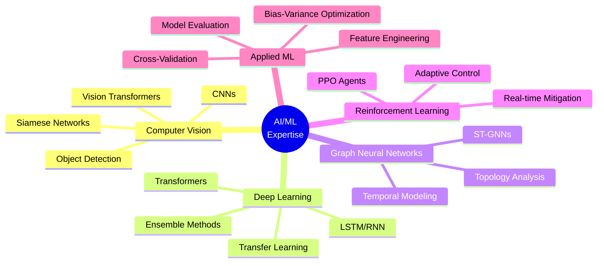

# 🚀 Vaibhav Chaudhary | AI/ML Engineer

<div align="center">

[](https://git.io/typing-svg)


</div>

---


### 🧠 About Me

```python
class AIEngineer:
    def __init__(self):
        self.name = "Vaibhav Chaudhary"
        self.role = "AI/ML Engineer"
        self.location = "Banda, Uttar Pradesh, IN"
        self.education = "B.Tech Electrical Engineering"
        self.interests = ["Computer Vision", "Smart Grids", 
                         "Cybersecurity", "Deep Learning"]
    
    def current_focus(self):
        return {
            "research": "Cyber-Physical AI Systems",
            "development": "End-to-End ML Pipelines",
            "learning": "Vision Transformers & Graph Neural Networks"
        }
    
    def get_expertise(self):
        return [
            "Spatio-Temporal Graph Neural Networks",
            "Transformer-LSTM Hybrids",
            "Siamese & Contrastive Learning",
            "Reinforcement Learning (PPO)",
            "CNN & Vision Transformers"
        ]

me = AIEngineer()
```

---

## 🎯 Flagship Projects

<div align="center">

### 🌟 Featured Work

</div>

<table>
<tr>
<td width="50%">

#### 🧹 SaafSaksham
**AI-Powered Civic Cleanliness Verification**

```yaml
Tech Stack:
  - Vision Transformers
  - Siamese Networks
  - Contrastive Learning
  - MongoDB + REST APIs
  
Impact:
  - Fraud Detection: ✅
  - Confidence Scoring: 95%+
  - Scalable SaaS Architecture
```

[](https://github.com/VaibhavChaudhary14/SaafSaksham)

</td>
<td width="50%">

#### ⚡ Smart Grid Cyberattack Detection
**AI/ML-Based Security Framework**

```yaml
Tech Stack:
  - ST-GNNs (Graph Neural Networks)
  - Transformer-LSTM Hybrids
  - PPO Reinforcement Learning
  - Ensemble Classifiers
  
Metrics:
  - Detection Accuracy: 97-99%
  - Localization: 92%
  - Real-time Mitigation
```

</td>
</tr>
</table>

---

## 🛠️ Technology Arsenal

<div align="center">

### Programming & ML Frameworks


### Web & DevOps


</div>

---

## 📊 Deep Learning Specializations

<div align="center">



</div>

---

## 🎓 Domain Expertise

<div align="center">

| 🔋 **Electrical Engineering** | 🤖 **AI/ML Systems** | 🔒 **Cybersecurity** |
|:---:|:---:|:---:|
| Smart Grids | Computer Vision | Cyberattack Detection |
| Power Systems | Deep Learning Pipelines | Anomaly Detection |
| 400kV Substations | Model Deployment | Security Protocols |
| IEEE Standards | MLOps | Vulnerability Analysis |

</div>

---

## 💼 Professional Experience

<details open>
<summary><b>🏢 UP Power Transmission Corporation Ltd. (UPPTCL)</b> - Vocational Trainee</summary>

- 🔌 Hands-on experience with **400 kV extra-high-voltage infrastructure**
- 🛡️ Safety protocols, fault handling, and preventive maintenance
- ⚡ Transformer, breaker, and protection relay operations analysis
- 📊 Transmission system reliability optimization

</details>

<details>
<summary><b>💻 ScienceOverse</b> - Frontend Developer</summary>

- 🎨 Built production interfaces for **100+ users**
- 🔐 Integrated authentication workflows
- 🧪 Tested **15+ REST APIs** using Postman
- ⚛️ Tech Stack: React, Next.js, Tailwind CSS

</details>

---

## 🎖️ Leadership & Impact

<div align="center">

### 👨‍💼 Chairperson, IEEE Student Branch - REC Banda

```ascii
┌─────────────────────────────────────────────┐
│  📚 Technical Workshops                     │
│  🎤 Guest Lectures on Emerging Tech         │
│  👥 Engaging 200+ Students Annually         │
│  🚀 Driving Innovation & Learning           │
└─────────────────────────────────────────────┘
```

</div>

---

## 📈 GitHub Analytics

<div align="center">


</div>

---

## 🏆 Key Achievements

<div align="center">

| Achievement | Metric |
|------------|--------|
| 🎯 Cyberattack Detection Accuracy | **97-99%** |
| 📍 Attack Localization Accuracy | **92%** |
| 👥 Students Impacted (IEEE) | **200+** |
| 🚀 Production Users Served | **100+** |
| 🔬 REST APIs Integrated & Tested | **15+** |

</div>

---

## 🌐 Connect With Me

<div align="center">

[](https://vaibhav-14ry.vercel.app/)
[](https://www.linkedin.com/in/vaibhavchaudhary14)
[](https://github.com/VaibhavChaudhary14)
[](mailto:14vaibhav2002@gmail.com)

</div>

---

<div align="center">

### 💡 "Building intelligent systems that bridge the gap between AI research and real-world impact"


</div>

---

<div align="center">

```ascii
╔══════════════════════════════════════════════════════════════╗
║  🎯 Currently Building: Next-Gen AI Solutions                ║
║  📚 Learning: Advanced RL & Multi-Modal Transformers         ║
║  🤝 Open to: Collaborations in Computer Vision & Smart Grids ║
╚══════════════════════════════════════════════════════════════╝
```

**⭐ If you find my work interesting, consider starring my repositories!**

</div>
