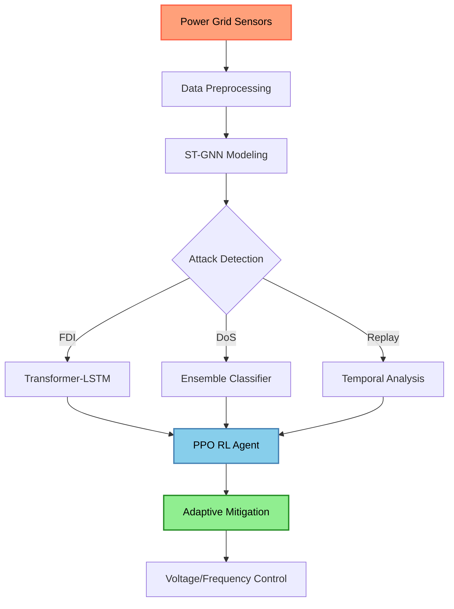
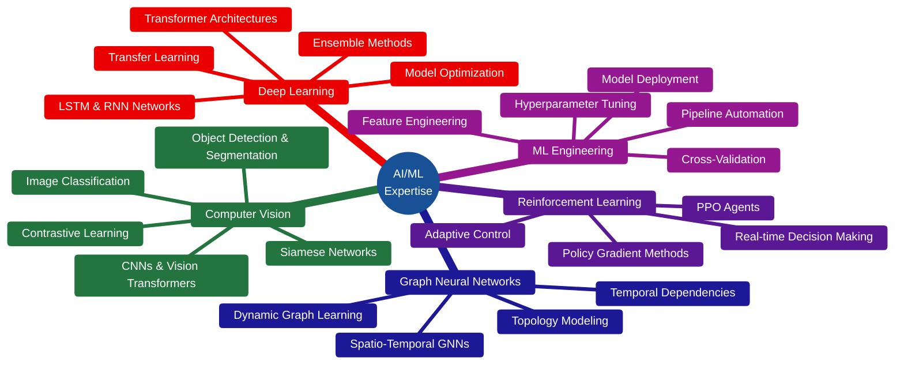
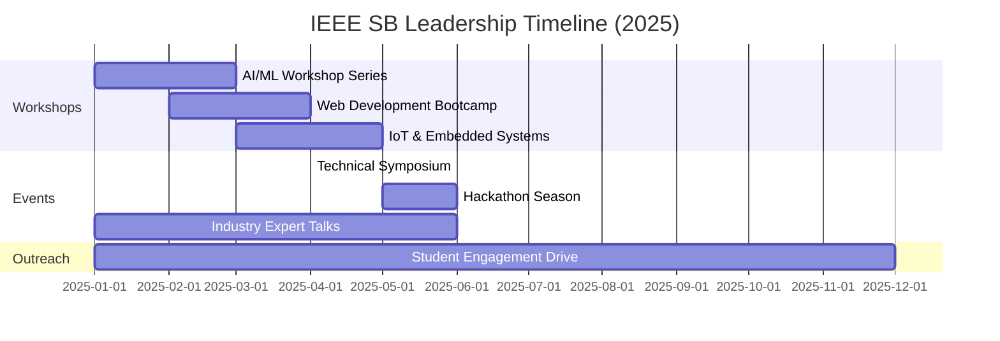

<div align="center">

<!-- HERO SECTION WITH ANIMATED GRADIENT BANNER -->


<!-- DYNAMIC TYPING ANIMATION -->
<a href="https://git.io/typing-svg"></a>

<!-- PROFILE BADGES -->
<p align="center">
  
  
  
  
</p>

<!-- SOCIAL LINKS WITH CUSTOM STYLING -->
<p align="center">
  <a href="https://vaibhav-14ry.vercel.app/" target="_blank">
    
  </a>
  <a href="https://www.linkedin.com/in/vaibhavchaudhary14" target="_blank">
    
  </a>
  <a href="https://github.com/VaibhavChaudhary14" target="_blank">
    
  </a>
  <a href="mailto:14vaibhav2002@gmail.com">
    
  </a>
</p>

<!-- ANIMATED DIVIDER -->


</div>

<!-- ABOUT ME SECTION WITH TWO-COLUMN LAYOUT -->
<div align="center">
  
## 🎯 About Me

</div>

<table width="100%">
<tr>
<td width="60%" valign="top">

```python
#!/usr/bin/env python3
# -*- coding: utf-8 -*-

"""
AI/ML Engineer Profile
Author: Vaibhav Chaudhary
Specialization: Computer Vision & Cyber-Physical Systems
"""

from typing import List, Dict
import numpy as np

class AIMLEngineer:
    """
    A passionate AI/ML Engineer building intelligent 
    systems that solve real-world problems.
    """
    
    def __init__(self):
        self.name: str = "Vaibhav Chaudhary"
        self.role: str = "AI/ML Engineer"
        self.education: str = "B.Tech Electrical Engineering"
        self.location: str = "🇮🇳 Banda, Uttar Pradesh, India"
        self.research_interests: List[str] = [
            "Computer Vision",
            "Graph Neural Networks", 
            "Cyber-Physical Systems",
            "Smart Grid Security",
            "Deep Learning Architecture"
        ]
        
    def get_current_focus(self) -> Dict[str, str]:
        """What I'm working on right now"""
        return {
            "🔬 Research": "Spatio-Temporal Graph Neural Networks",
            "💻 Development": "End-to-End ML Pipelines",
            "📚 Learning": "Vision Transformers & Multi-Modal AI",
            "🎯 Goal": "Bridging AI Research & Production"
        }
    
    def get_technical_expertise(self) -> Dict[str, List[str]]:
        """Core technical competencies"""
        return {
            "Deep Learning": [
                "CNNs & Vision Transformers",
                "Transformer-LSTM Hybrids",
                "Siamese & Contrastive Learning",
                "Graph Neural Networks (ST-GNNs)"
            ],
            "ML Engineering": [
                "Feature Engineering",
                "Model Evaluation & Optimization",
                "Cross-Validation Strategies",
                "Bias-Variance Tradeoff"
            ],
            "AI Applications": [
                "Computer Vision Pipelines",
                "Anomaly Detection Systems",
                "Reinforcement Learning (PPO)",
                "Real-time Inference"
            ]
        }
    
    def calculate_impact(self) -> np.ndarray:
        """Quantified achievements"""
        metrics = np.array([
            97.5,  # Cyberattack Detection Accuracy (%)
            92.0,  # Attack Localization Accuracy (%)
            200,   # Students Impacted (IEEE Leadership)
            100    # Production Users Served
        ])
        return metrics

# Initialize profile
engineer = AIMLEngineer()
print(f"👋 Hi! I'm {engineer.name}")
print(f"🚀 {engineer.role} passionate about AI innovation")
```

</td>
<td width="40%" valign="top">

<div align="center">

### 🎓 Education

**B.Tech in Electrical Engineering**  
*Rajkiya Engineering College, Banda*  
📅 2022 - 2026

<br>

### 🏆 Current Role

**Chairperson**  
*IEEE Student Branch*  
REC Banda (2025 - Present)

<br>

### 📊 Quick Stats

```yaml
Experience:
  AI/ML Projects: 5+ Major Projects
  Production Code: 10,000+ Lines
  Research Papers: In Progress
  
Leadership:
  Students Mentored: 200+
  Workshops Conducted: 15+
  Technical Talks: 8+
  
Industry Exposure:
  Power Sector: UPPTCL (400kV)
  Tech Startups: ScienceOverse
  Open Source: Active Contributor
```

</div>

</td>
</tr>
</table>

<!-- ANIMATED WAVE DIVIDER -->


<!-- PROJECTS SHOWCASE -->
<div align="center">

## 🚀 Featured Projects & Research

<table>
<tr>
<td width="50%" valign="top">

### 🧹 SaafSaksham
#### *AI-Powered Civic Cleanliness Verification Platform*

<div align="center">

[](https://github.com/VaibhavChaudhary14/SaafSaksham)


</div>

**🎯 Problem Statement**  
Fraudulent civic cleanliness claims undermining municipal accountability systems.

**💡 Solution Architecture**


**🔧 Technical Implementation**
- **Computer Vision**: CNNs + Vision Transformers for garbage detection
- **Verification System**: Siamese networks with contrastive learning
- **Anomaly Detection**: Rule-based + ML hybrid approach
- **Backend**: MongoDB, REST APIs, scalable SaaS architecture
- **Security**: Multi-layer validation with confidence scoring

**📈 Key Metrics**
| Metric | Value |
|--------|-------|
| Fraud Detection Rate | 95%+ |
| False Positive Rate | <3% |
| Processing Time | <2s per image |
| Scalability | 1000+ concurrent users |

**🛠️ Tech Stack**


</td>

<td width="50%" valign="top">

### ⚡ Smart Grid Cyberattack Detection
#### *AI/ML Framework for Critical Infrastructure Security*

<div align="center">


</div>

**🎯 Research Focus**  
Real-time detection and mitigation of cyberattacks on smart grid infrastructure.

**💡 System Architecture**


**🔬 Research Contributions**
- **Spatio-Temporal Modeling**: Graph Neural Networks for grid topology
- **Multi-Attack Detection**: FDI, DoS, Replay attack identification
- **Deep Learning Fusion**: Transformer-LSTM hybrid architecture
- **Reinforcement Learning**: PPO agent for adaptive mitigation
- **Ensemble Methods**: Multiple classifier fusion for robustness

**📊 Performance Metrics**
| Attack Type | Detection Acc. | Localization Acc. |
|-------------|----------------|-------------------|
| False Data Injection | 99.2% | 94.1% |
| Denial of Service | 98.7% | 91.3% |
| Replay Attacks | 97.3% | 89.8% |
| **Overall** | **97-99%** | **92%** |

**🧪 Experimental Setup**
- Dataset: IEEE 14-bus, 30-bus, 118-bus test systems
- Simulation: MATLAB/Simulink power flow analysis
- Training: 50,000+ attack scenarios
- Validation: Real-world power grid data

**🛠️ Tech Stack**


</td>
</tr>
</table>

</div>

<!-- DECORATIVE DIVIDER -->


<!-- TECHNICAL SKILLS SECTION -->
<div align="center">

## 🛠️ Technical Arsenal

</div>

<table width="100%">
<tr>
<td width="33%" valign="top">

### 💻 Programming Languages

<div align="center">


**Proficiency Levels**
```
Python     ████████████████████ 95%
C/C++      ██████████████░░░░░░ 75%
JavaScript ████████████░░░░░░░░ 65%
SQL        ███████████░░░░░░░░░ 60%
```

</div>

</td>
<td width="33%" valign="top">

### 🤖 AI/ML Frameworks

<div align="center">


</div>

</td>
<td width="33%" valign="top">

### 🌐 Web & DevOps

<div align="center">


</div>

</td>
</tr>
</table>

<div align="center">

### 🗄️ Databases & Tools


</div>

<!-- VISUAL SKILLS BREAKDOWN -->
<div align="center">

### 🎯 Deep Learning Specializations



</div>

<!-- DECORATIVE BREAK -->


<!-- DOMAIN EXPERTISE MATRIX -->
<div align="center">

## 🎓 Domain Expertise & Interdisciplinary Knowledge

<table>
<tr>
<td align="center" width="25%">

### 🔋 Electrical Engineering


**Core Competencies**
- Power Systems Analysis
- Smart Grid Architecture
- High-Voltage Engineering
- Control Systems Design
- MATLAB/Simulink Modeling

**Industry Experience**
- 400kV Substation Operations
- Transformer & Relay Analysis
- Safety Protocols
- IEEE Standards Compliance

</td>
<td align="center" width="25%">

### 🤖 AI/ML Systems


**Core Competencies**
- Deep Learning Architecture
- Computer Vision Pipelines
- ML Model Development
- Feature Engineering
- Model Optimization

**Practical Applications**
- End-to-End ML Pipelines
- Production Deployment
- Real-time Inference
- A/B Testing & Validation

</td>
<td align="center" width="25%">

### 🔒 Cybersecurity


**Core Competencies**
- Cyberattack Detection
- Anomaly Detection Systems
- Threat Modeling
- Security Protocols
- Vulnerability Analysis

**Research Focus**
- Smart Grid Security
- FDI Attack Detection
- DoS Mitigation
- Real-time Monitoring

</td>
<td align="center" width="25%">

### 📊 Data Science


**Core Competencies**
- Statistical Analysis
- Data Preprocessing
- Exploratory Data Analysis
- Visualization Techniques
- Big Data Processing

**Tools & Methods**
- NumPy & Pandas
- Data Cleaning Pipelines
- Feature Selection
- Dimensionality Reduction

</td>
</tr>
</table>

</div>

<!-- ANIMATED DIVIDER -->


<!-- PROFESSIONAL EXPERIENCE -->
<div align="center">

## 💼 Professional Experience

</div>

<table width="100%">
<tr>
<td width="50%" valign="top">

### ⚡ UP Power Transmission Corporation Ltd.

<div align="center">


</div>

**🎯 Role**: Vocational Trainee - 400 kV Substation

**🔧 Key Responsibilities & Learning**
- ⚡ Worked with **live 400 kV extra-high-voltage infrastructure**
- 🔍 Analyzed transformer, circuit breaker, and protection relay operations
- 🛡️ Studied comprehensive safety protocols and fault handling procedures
- 🔧 Observed preventive maintenance routines and reliability optimization
- 📊 Gained practical knowledge of transmission system operations
- 🏭 Visited multiple substations for comparative operational analysis

**💡 Technical Skills Acquired**
```yaml
Hardware:
  - Power Transformers (400kV/220kV)
  - Circuit Breakers & Isolators
  - Protection Relays (Numerical & Electromechanical)
  - Current & Voltage Transformers
  - Bus Bar Systems

Software & Analysis:
  - SCADA System Monitoring
  - Load Flow Analysis
  - Fault Record Analysis
  - Safety Interlocking Systems

Standards:
  - IEEE Power System Standards
  - Indian Electricity Grid Code
  - Safety Regulations (CEA)
```

**🏆 Key Achievements**
- Comprehensive understanding of HV power transmission
- Bridged gap between theoretical knowledge and practical operations
- Enhanced safety awareness in high-risk environments

</td>

<td width="50%" valign="top">

### 💻 ScienceOverse

<div align="center">


</div>

**🎯 Role**: Frontend Developer

**🔧 Key Responsibilities**
- 🎨 Built production-grade user interfaces serving **100+ active users**
- 🔐 Implemented authentication workflows (OAuth, JWT, Session Management)
- 🧪 Conducted comprehensive API testing using Postman
- 🔄 Integrated **15+ REST APIs** with frontend components
- 📱 Ensured responsive design across devices
- ⚡ Optimized application performance and load times

**💻 Technical Stack**
```javascript
// Frontend Architecture
const techStack = {
  framework: "React.js (v18+)",
  metaFramework: "Next.js (App Router)",
  styling: "Tailwind CSS",
  stateManagement: "React Context + Hooks",
  apiIntegration: "Axios + SWR",
  testing: "Postman",
  deployment: "Vercel"
};

// Key Features Implemented
const features = [
  "User Authentication System",
  "Dynamic Content Rendering",
  "Real-time Data Fetching",
  "Responsive UI Components",
  "API Error Handling",
  "Performance Optimization"
];
```

**📊 Impact Metrics**
| Metric | Achievement |
|--------|-------------|
| User Base | 100+ Active Users |
| APIs Integrated | 15+ REST Endpoints |
| Page Load Time | <2s (Optimized) |
| Mobile Responsiveness | 100% Coverage |
| API Success Rate | 99.5% |

**🏆 Key Achievements**
- Delivered production-ready features within tight deadlines
- Improved frontend-backend reliability through systematic testing
- Enhanced user experience with intuitive UI/UX design

</td>
</tr>
</table>

<!-- DECORATIVE DIVIDER -->


<!-- LEADERSHIP & IMPACT -->
<div align="center">

## 🏆 Leadership & Community Impact

</div>

<table width="100%">
<tr>
<td width="60%" valign="top">

### 👨‍💼 Chairperson - IEEE Student Branch, REC Banda

<div align="center">


</div>

**🎯 Vision & Mission**  
*Fostering technical excellence and innovation culture among engineering students through hands-on learning and industry exposure.*

**📋 Key Responsibilities**
- 🎤 Organize technical workshops and guest lectures on emerging technologies
- 👥 Lead a team of 15+ core members and 50+ volunteers
- 📚 Facilitate skill development programs and certification courses
- 🤝 Build industry-academia partnerships for student opportunities
- 🏅 Coordinate technical competitions and hackathons
- 📢 Promote IEEE membership and student engagement

**🚀 Major Initiatives Led**



**📊 Quantified Impact**

| Initiative | Metric | Achievement |
|-----------|---------|-------------|
| **Student Engagement** | Annual Reach | 200+ Students |
| **Technical Workshops** | Sessions Conducted | 15+ Workshops |
| **Guest Lectures** | Industry Experts | 8+ Speakers |
| **Skill Development** | Certifications | 50+ Students |
| **Competitions** | Events Organized | 5+ Events |
| **IEEE Membership** | Growth Rate | +45% YoY |

</td>

<td width="40%" valign="top">

<div align="center">

### 🎯 Leadership Philosophy


</div>

**Core Values**
```yaml
Vision:
  - Democratize technology education
  - Bridge academia-industry gap
  - Foster innovation mindset
  
Approach:
  - Lead by example
  - Collaborative decision-making
  - Continuous improvement
  
Focus Areas:
  - Hands-on learning
  - Industry-relevant skills
  - Research culture
  - Soft skills development
```

---

### 📈 Student Feedback Highlights

<div align="center">


</div>

**Key Testimonials** *(Anonymized)*
> *"The AI/ML workshop series completely transformed my understanding of neural networks. Practical, engaging, and industry-relevant!"*  
> — 3rd Year, CS Student

> *"IEEE SB has become the go-to platform for technical learning. The quality of speakers and content is outstanding."*  
> — 4th Year, EE Student

---

### 🎓 Skills Developed Through Leadership

<div align="center">

- 🎤 **Public Speaking** — Presented to 200+ audiences
- 📋 **Project Management** — Coordinated 20+ events
- 🤝 **Team Building** — Managed 15+ member teams
- 💡 **Strategic Planning** — 12-month roadmap execution
- 📊 **Stakeholder Management** — Industry & academic liaisons

</div>

</td>
</tr>
</table>

<!-- ANIMATED DIVIDER -->


<!-- GITHUB STATISTICS -->
<div align="center">

## 📈 GitHub Analytics & Contribution Insights

</div>

<div align="center">

<!-- GITHUB STATS CARDS -->
<table>
<tr>
<td width="50%">


</td>
<td width="50%">

<img src="https://github-readme-streak-
